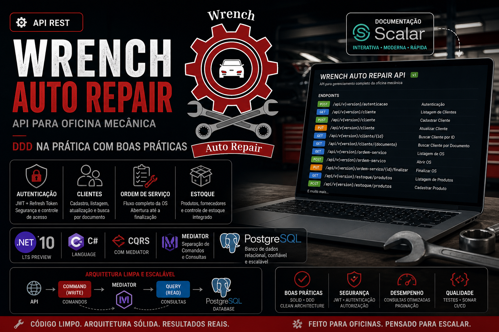
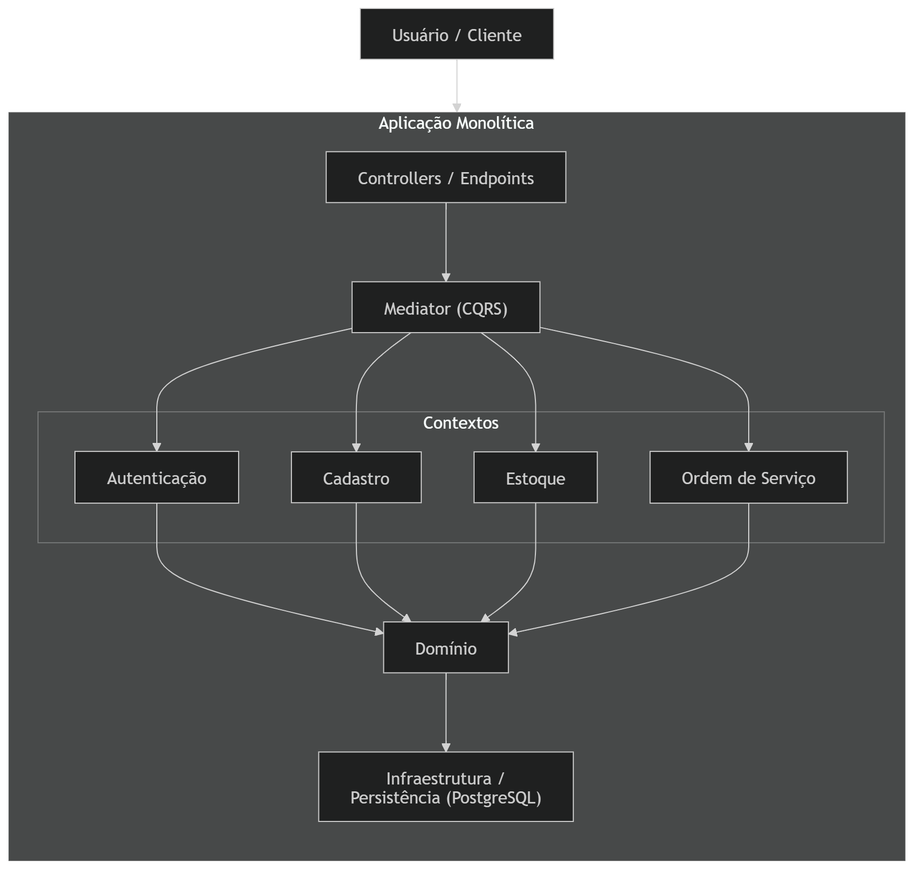
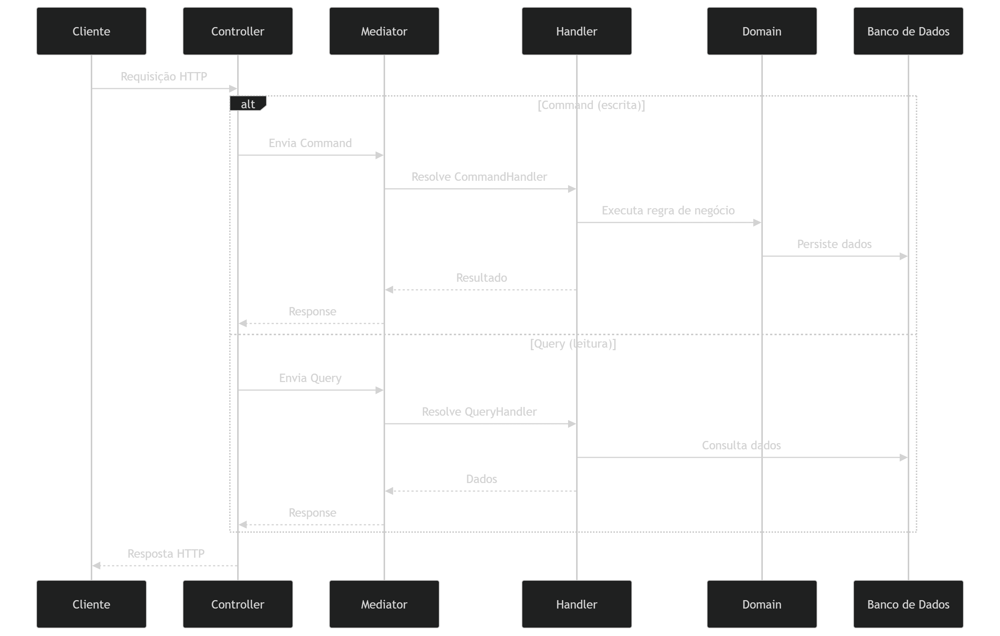

# Tech Challange - FASE 01 (DDD)

**Nome do Projeto**: Projeto Chave Inglesa

**Descrição**: Esse projeto aborda a criação de um **Sistema Integrado de Atendimento e Execução de Serviços** aplicando as boas práticas do DDD e desenvolvimento seguro.

## Participantes - Grupo BGT³
| Nome | Matrícula | E-mail | Discord |
|------|-----------|--------|---------|
| Thiago Rodrigues Ribeiro Santana Santos | RM 370291 | thiago_santos14@hotmail.com | thiagoribeiro0611 |
| Bruno da Cruz Barreto | RM 370310 | brunocbarreto2012@gmail.com | bbarreto08 |
| Gabriel Sanchez Fadel Zamai | RM 370308 | gsfzamai@gmail.com | gsfzamai |

---

## Vídeo de demonstração (assista!)

[](https://www.youtube.com/watch?v=gTRRVQVVjiE)

---

## Wrench Auto Repair


## A História

### As Origens

Era 2003, em uma cidade do interior paulista, quando Roberto Mendes, então com 28 anos, decidiu transformar sua paixão por motores em negócio. Com as mãos calejadas de anos trabalhando como mecânico em oficinas alheias e algumas economias guardadas a duras penas, ele alugou um galpão pequeno na Rua dos Ipês, comprou um elevador hidráulico usado e pendurou uma placa artesanal na fachada:
> **"Wrench — Consertos com Honestidade"**

O nome veio do inglês mesmo, uma homenagem ao pai, que passava os finais de semana lendo revistas americanas de automobilismo e sempre dizia que uma boa chave de boca — a wrench — era o símbolo do mecânico honesto: simples, confiável e essencial.
Nos primeiros anos, Roberto trabalhava sozinho. Conhecia cada cliente pelo nome, lembrava do histórico de cada carro de cabeça e anotava tudo num caderno azul surrado que ficava sobre o balcão. A qualidade do trabalho correu de boca em boca, e a fila de espera começou a crescer.
A Expansão
Em 2010, Roberto contratou seus primeiros dois mecânicos: Davi, especialista em motores a diesel, e Juliana, a primeira mulher mecânica da cidade, com um talento impressionante para diagnósticos elétricos. A dupla trouxe nova energia à oficina.
O galpão pequeno foi trocado por um espaço maior na Avenida Industrial. A placa ganhou um novo visual, e o nome evoluiu para o que é hoje:

### Wrench Auto Repair

Com isso vieram mais clientes, mais serviços, mais peças em estoque — e também mais desafios. O caderno azul do Roberto não era mais suficiente.
Os Problemas Crescem com o Negócio
Em 2018, a Wrench Auto Repair já contava com 12 funcionários, uma frota de clientes fidelizados e parcerias com seguradoras locais. Mas por dentro, a operação começava a ranger — como um motor sem revisão.
Peças sumiam do estoque sem explicação. Clientes ligavam perguntando o status do carro e ninguém sabia responder com precisão. Orçamentos eram esquecidos em gavetas. Uma vez, um cliente retirou o carro sem que o serviço tivesse sido concluído — simplesmente porque ninguém tinha anotado que ainda faltava a troca do filtro de ar.
Roberto começou a chegar mais cedo e sair mais tarde, apagando incêndios que poderiam ser evitados. Certa noite, sentado na oficina vazia com uma xícara de café frio, ele olhou para o caderno azul — agora o quinto de uma série — e disse em voz alta:
> "Até quando?"

### A Virada

Foi a filha de Roberto, Camila Mendes, recém-formada em Sistemas de Informação, quem trouxe a resposta. Ela convenceu o pai de que a oficina precisava de mais do que planilhas improvisadas — precisava de um sistema integrado, robusto e feito sob medida para a realidade da Wrench.
Com o apoio de uma equipe de desenvolvedores, o projeto foi batizado internamente de "Projeto Chave Inglesa" — uma brincadeira com o nome da oficina — e o desenvolvimento do back-end do sistema começou. A proposta era clara: digitalizar cada etapa do atendimento, desde o momento em que o cliente chega com o carro até a entrega das chaves com o serviço concluído.

---

## 🏗️ Arquitetura do Projeto

### Visão Geral

O sistema foi projetado utilizando uma **arquitetura monolítica modular**, priorizando simplicidade operacional sem abrir mão de organização interna e separação de responsabilidades. Embora seja implantado como uma única aplicação, o código é estruturado de forma lógica em **contextos bem definidos**, o que facilita manutenção, evolução e possível extração futura para microsserviços, caso necessário.



---

### 📦 Contextos do Domínio

A aplicação está dividida em quatro principais **bounded contexts**, cada um responsável por um conjunto específico de regras de negócio:

* **Autenticação**
  Responsável por controle de acesso, login, gestão de usuários e permissões.

* **Cadastro**
  Gerencia entidades centrais do sistema, como clientes, veículos e demais informações cadastrais.

* **Estoque**
  Controla peças, insumos e movimentações de inventário.

* **Ordem de Serviço**
  Núcleo operacional do sistema, responsável pela criação, acompanhamento e finalização das ordens de serviço.

Cada contexto possui suas próprias entidades, regras e casos de uso, reduzindo acoplamento e evitando que regras de negócio se misturem indevidamente.

---

### 🔄 Padrão CQRS com Mediator

O projeto adota o padrão **CQRS (Command Query Responsibility Segregation)** em conjunto com um **mediator** para orquestração das operações.

#### Separação de responsabilidades

* **Commands**: Representam operações de escrita (criação, atualização, remoção).
* **Queries**: Responsáveis por operações de leitura.

Essa separação traz benefícios como:

* Maior clareza na intenção do código
* Facilidade de manutenção
* Possibilidade de otimizações específicas para leitura e escrita

#### Uso de Mediator

Todas as interações entre camadas são mediadas por um componente central (mediator), que:

* Desacopla controllers dos handlers de negócio
* Centraliza o fluxo de execução
* Facilita a implementação de pipelines (ex: validação, logging, transações)

Fluxo típico:

```
Controller → Command/Query → Mediator → Handler → Domínio/Infraestrutura
```



---

### 🎯 Benefícios da Abordagem

* **Organização modular dentro de um monólito**
* **Baixo acoplamento entre contextos**
* **Alta coesão dentro de cada domínio**
* **Facilidade para testes unitários e evolução incremental**
* **Preparação para escalabilidade futura (ex: microsserviços)**

---

## 🚀 Como Executar o Projeto

Os scripts de execução ficam em [`wrench.auto.repair/scripts`](wrench.auto.repair/scripts) execute os comandos dentro desse diretório.

### Subir a aplicação

Ao subir a aplicação, será iniciado um container docker da aplicação e do postgres, estão sendo usada as portas **5432** (database) e **8080** para API, certifique-se se essas duas portas estão disponíveis.

```powershell
docker-compose up
```

Aguarde a execução até que exiba *Now listening on: http://[::]:8080* , nesse processo está sendo gerado o build da aplicação, executando o PostgreSQL e as migrations da estrutura do banco de dados.

- Acesse agora a url http://localhost:8080/docs-ui
- A api está versionada pela URL, então para cada endpoint que for chamar, na UI da documentação na seção "Variables", haverá um parâmetro *version*, ele é obrigatório e deve ser usado o valor *1*
  
- A execução da aplicação já crie um usuário Admin: __Usuário:__ admin@wrench.com.br | __Senha:__ ?X7I3n~(694*7kGjy9'Zf%tN

### Executar todos os testes (unitários e de integraação)

Serão executado primeiramente todos testes unitários e após serão executados os de integração, ao final da execução de cada projeto de teste é exibida uma estatística de quantidade (testes totais, total de sucesso e total de falhas)

```powershell

docker-compose -f docker-compose.test.yml up --abort-on-container-exit 

```

---

## Documentação DDD

No link do Miro abaixo, está toda a documentação relacionada:
- Linguagem Pictográfica
- Jornada AS-IS
- Jornada TO BE (Ordem de Serviço)
- Jornada TO BE (Estoque)
- Linguagem Ubíqua
- Contextos Delimitados
- Event Storming
- Mapa de Contexto

[](https://miro.com/app/board/uXjVGuaIszk=/?share_link_id=188169996234)

Obs: a linguagem ubíqua também pode ser encontrada [aqui](./docs/linguagem-ubiqua/linguage-ubiqua.md)

---

## ADR 001 - Escolha do Banco de Dados

[ADR-001](https://github.com/euthribeiro/tech-challange-fiap-fase-1/blob/master/docs/adrs/ADR%20001%20-%20Escolha%20do%20Banco%20de%20Dados.md)

---

## Cobertura de testes

Para geração dos testes foi usado o XUnit, tanto para testes unitário e de integração, usando um plugin para gerar o arquivo
abaixo com os detalher dos testes.

[Cobertura](https://euthribeiro.github.io/tech-challange-fiap-fase-1/wrench.auto.repair/coverage-report/index.html)

---

## Relatórios SonarQube
- [Relatório — Inicial (04/05/2026)](./docs/sonar/wrench-auto-repair-sonar-qube-tela-inicial.pdf)
- [Relatório — Confiabildiade Part-1 (04/05/2026)](./docs/sonar/wrench-auto-repair-sonar-qube-tela-issues-confiabilidade-exemplo.pdf)
- [Relatório — Confiabildiade Part-2 (04/05/2026)](./docs/sonar/wrench-auto-repair-sonar-qube-tela-issues-confiabilidade.pdf)
- [Relatório — Manutenabilidade Part-1 (04/05/2026)](./docs/sonar/wrench-auto-repair-sonar-qube-tela-issues-manutenabilidade-exemplo.pdf)
- [Relatório — Manutenabilidade Part-2 (04/05/2026)](./docs/sonar/wrench-auto-repair-sonar-qube-tela-issues-manutenabilidade.pdf)
- [Relatório — Segurança Part-1 (04/05/2026)](./docs/sonar/wrench-auto-repair-sonar-qube-tela-issues-seguranca-exempo.pdf)
- [Relatório — Segurança Part-2 (04/05/2026)](./docs/sonar/wrench-auto-repair-sonar-qube-tela-issues-seguranca.pdf)
- [Relatório — Issues (04/05/2026)](./docs/sonar/wrench-auto-repair-sonar-qube-tela-issues.pdf)
- [Relatório — Projetos (04/05/2026)](./docs/sonar/wrench-auto-repair-sonar-qube-tela-projetos.pdf)

---

## Relatório OWASP Dependency Check

- [Relatório (05/05/2026)](./docs/owasp/dependency-check-report.html)
